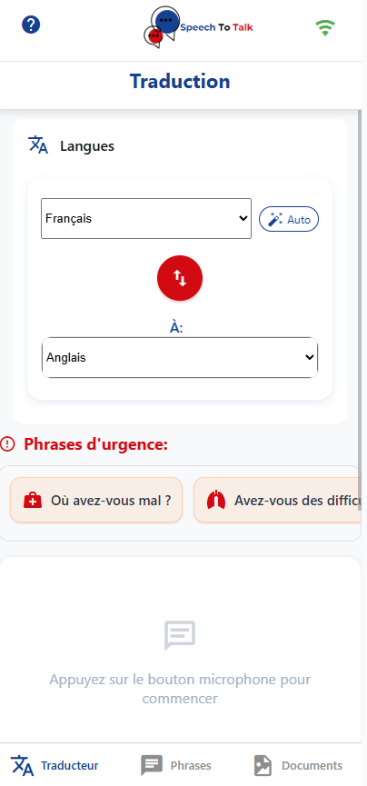
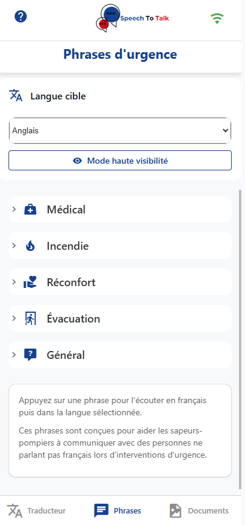
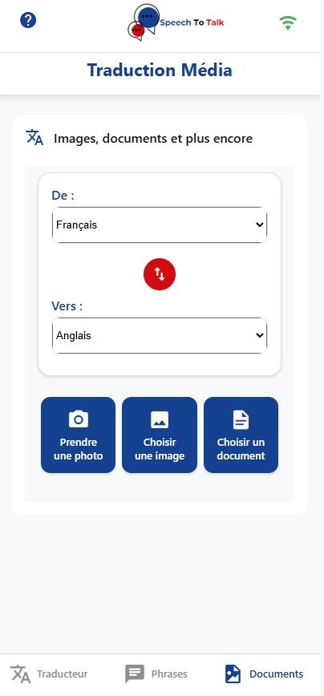

# SpeakFlow

## Logo

  

## À propos de l'application
SpeakFlow est une application PWA de traduction vocale en temps réel conçue spécifiquement pour les sapeurs-pompiers qui sont au contact de personnes ne parlant pas français. L'application utilise la reconnaissance vocale pour capturer la parole, la traduit dans la langue cible, et peut même prononcer la traduction à haute voix. Grâce à son système de cache, elle peut fonctionner hors ligne dans des situations d'urgence.

## Fonctionnalités principales
- ✅ Traduction vocale en temps réel : Parlez dans votre langue et obtenez une traduction instantanée
- ✅ Détection automatique de langue : Identification automatique de la langue parlée pour une communication plus rapide en situation d'urgence
- ✅ Interface utilisateur intuitive : Design moderne et cohérent avec des composants réutilisables
- ✅ Navigation fluide : Transitions animées entre les pages avec React Router et interface responsive
- ✅ Phrases d'urgence prédéfinies : Accès rapide à des phrases essentielles pour les situations d'urgence médicales
- ✅ Traduction de médias : Possibilité de traduire du texte à partir d'images et de documents
- ✅ Système de cache optimisé : Stockage intelligent des traductions avec stratégie LRU et limite de taille
- ✅ Mode hors ligne : Utilisez l'application même sans connexion internet (pour les langues téléchargées)
- ✅ Support multi-langues : Traduction entre plus de 15 langues
- ✅ Notification push : Recevez des notifications pour les mises à jour de l'application

## Fonctionnalités récemment implémentées

### Navigation fluide avec React Router
La nouvelle navigation implémentée avec React Router offre :
- Des transitions animées entre les pages grâce à Framer Motion
- Une barre de navigation inférieure adaptée aux appareils mobiles
- Une expérience utilisateur améliorée avec des animations fluides
- Une structure de code plus maintenable basée sur les routes
- Une meilleure gestion de l'historique de navigation

### Système de cache optimisé
Le nouveau système de cache optimisé permet :
- Une gestion intelligente des traductions stockées avec stratégie LRU (Least Recently Used)
- Une limitation du nombre d'entrées dans le cache (maximum 100 par défaut)
- Une troncature automatique des textes trop longs pour éviter de surcharger le stockage
- Une expiration automatique des entrées après 7 jours
- Une visualisation de la taille du cache dans les paramètres de l'application

### Traduction de médias
La fonctionnalité de traduction de médias permet aux utilisateurs de :
- Extraire et traduire du texte à partir d'images via OCR (reconnaissance optique de caractères)
- Extraire et traduire du texte à partir de documents (PDF, DOCX, TXT)
- Visualiser à la fois le texte original et sa traduction
- Consulter les détails techniques de l'OCR (niveau de confiance, position du texte)
- Utiliser cette fonctionnalité même en mode hors ligne grâce au cache local

### Notifications push
Le système de notifications push permet :
- De recevoir des alertes concernant les mises à jour de l'application
- D'être informé des nouvelles fonctionnalités disponibles
- De gérer les préférences de notification dans les paramètres
- D'activer/désactiver les notifications selon les besoins

Ces fonctionnalités utilisent les technologies web modernes :
- React Router et Framer Motion pour la navigation et les animations
- Web Push API et Service Workers pour les notifications
- Simulation d'OCR (préparé pour l'intégration d'une API réelle)
- LocalStorage optimisé avec stratégie LRU pour le cache

## Screenshots

  
  
  

## Prochaines étapes et améliorations

### Améliorations techniques
- Intégration d'une API OCR réelle pour remplacer la simulation actuelle (Google API)
- Développement d'un backend pour gérer les notifications push
- Optimisation des performances de reconnaissance vocale
- Tests unitaires et d'intégration pour améliorer la fiabilité

### Nouvelles fonctionnalités
- Historique des traductions avec possibilité de marquer des favoris
- Téléchargement de packs de langues pour une utilisation complète hors ligne
- Reconnaissance vocale améliorée pour les environnements bruyants
- Partage de traductions via différents canaux (SMS, email, etc.)

### Expérience utilisateur
- Tutoriel interactif pour les nouveaux utilisateurs
- Thèmes personnalisables (mode sombre, contraste élevé)
- Amélioration continue de l'interface responsive
- Amélioration de l'accessibilité pour les utilisateurs ayant des besoins spécifiques
- Animations et transitions plus sophistiquées

### Technologies et architecture
- Migration vers une architecture plus modulaire avec des hooks personnalisés
- Optimisation continue du système de cache
- Implémentation de tests automatiques pour les composants clés
- Mise en place d'un système de déploiement continu

